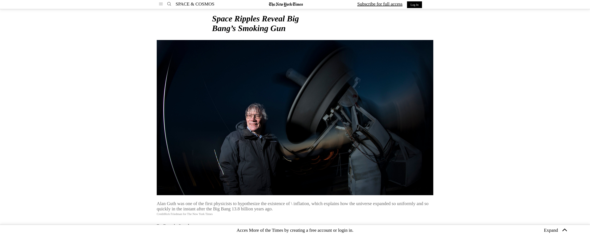

<!-- PROJECT LOGO -->
 

  

  <h3 align="center">New York Time Page</h3>

  

    A simple clone of the New York Time Page Article.
         
     
    ·
     <a href="https://rawcdn.githack.com/genzaraki/new-york-times-article-page/8e2adaab4e6f9e5462f7e283c001f6d348551db7/index.html">View Demo</a>
    ·    
  

<!-- TABLE OF CONTENTS -->
## Table of Contents

* [About the Project](#about-the-project)
  * [Built With](#built-with)
* [Contact](#contact)
* [Acknowledgements](#acknowledgements)

<!-- ABOUT THE PROJECT -->
## About The Project

  We are Amadou and Wilfried. We are part of the Microverse Project and we did this page according to the required specifications.  

### Build With

* [Html]()
* [CSS]()
* [VSCODE]()

### Contact
* Amadou - [@tigamadou](https://twitter.com/tigamadou) - [LinkedIn](https://www.linkedin.com/in/amadou-ibrahim-75769167) - [GitHub](https://github.com/genzaraki)
* Wilfried - [@WCanirinka](https://twitter.com/WCanirinka)  - [LinkedIn](https://www.linkedin.com/in/wilfried-canirinka-884ab0b6/) - [GitHub](https://github.com/WCanirinka)
* Project Link [https://github.com/genzaraki/new-york-times-article-page](https://github.com/genzaraki/new-york-times-article-page)

### Acknowledgements

* [GitHub](https://github.com)
* [VSCODE]()
* [StyleLint]()
* [Stickler]()
